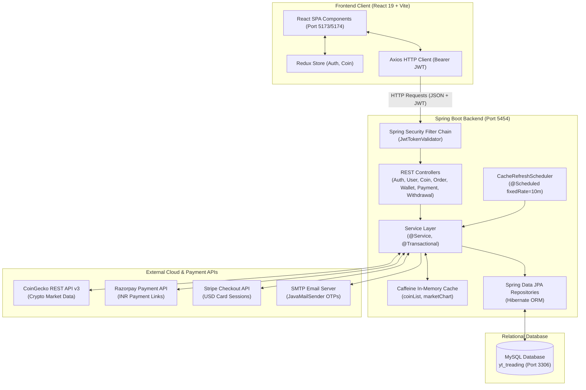
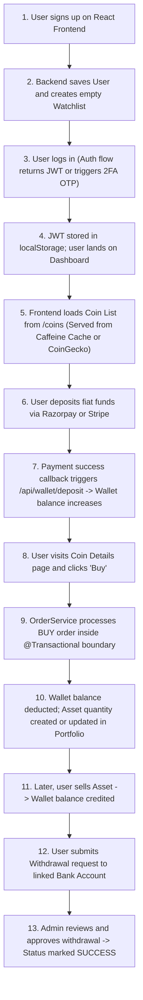
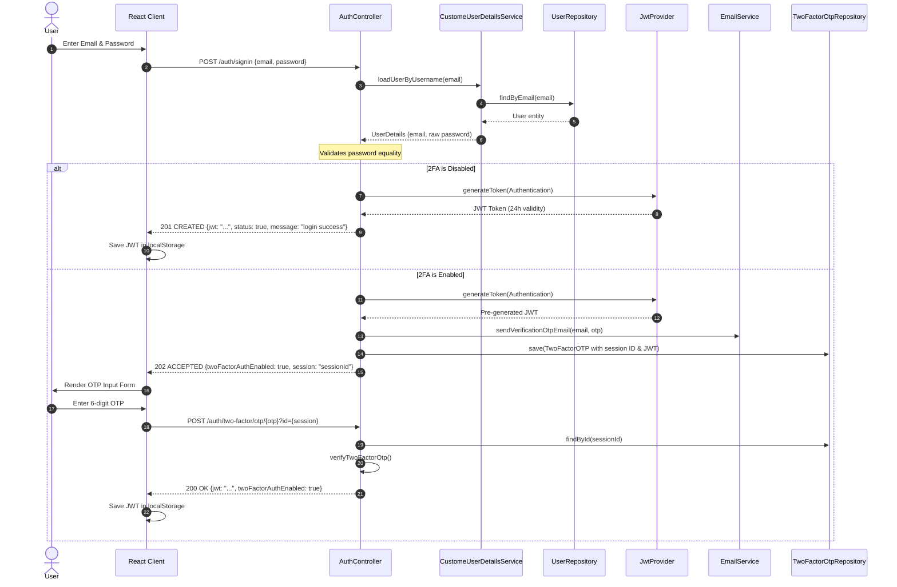
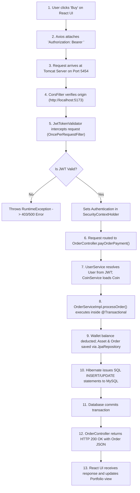
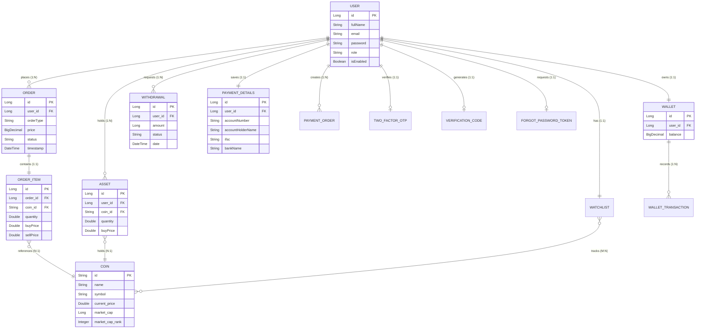
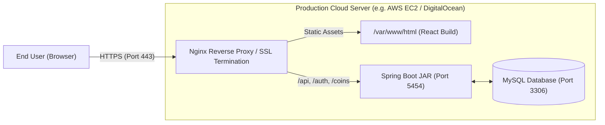

# PROJECT INTERVIEW GUIDE: CRYPTO TRADING & WALLET PLATFORM ("BitInsight")
> **Target Audience:** Junior / Fresher Java Full-Stack Developer  
> **Backend:** Java 21, Spring Boot 3.4.5, Spring Security 6, Spring Data JPA, Hibernate, MySQL, Caffeine Cache  
> **Frontend:** React 19, Vite 6, Redux (Thunk), Tailwind CSS, Radix UI, ApexCharts, Axios  
> **Integrations:** CoinGecko API, Razorpay Java SDK, Stripe Java SDK, JavaMailSender  
> **Git Branch:** `Balaram_Treading_Application` | **Author:** Balaram Gochhayat  

---

## Document Accuracy & Honesty Standard
Throughout this guide, every architectural detail and implementation claim is explicitly tagged:
- `[CONFIRMED FROM CODE]`: Directly present in the repository files, configurations, or classes.
- `[REASONABLE INFERENCE]`: Architectural rationale derived from actual code patterns.
- `[PARTIALLY IMPLEMENTED]`: Features with partial backend/frontend code or lacking production hardening.
- `[NOT IMPLEMENTED / FUTURE IMPROVEMENT]`: Features not present in the codebase that are typical interview topics or recommended enhancements.

---

# Table of Contents
1. [Project Overview](#1-project-overview)
2. [1-Minute Interview Explanation](#2-1-minute-interview-explanation)
3. [2–3 Minute Detailed Explanation](#3-23-minute-detailed-explanation)
4. [Business Problem](#4-business-problem)
5. [Users and Roles](#5-users-and-roles)
6. [Technology Stack](#6-technology-stack)
7. [System Architecture](#7-system-architecture)
8. [Complete End-to-End Flow](#8-complete-end-to-end-flow)
9. [Authentication Flow](#9-authentication-flow)
10. [Authorization / RBAC](#10-authorization--rbac)
11. [API Request Lifecycle](#11-api-request-lifecycle)
12. [Backend Structure](#12-backend-structure)
13. [Database Design](#13-database-design)
14. [Important APIs](#14-important-apis)
15. [Major Feature Flows](#15-major-feature-flows)
16. [Exception Handling](#16-exception-handling)
17. [Validation](#17-validation)
18. [Security](#18-security)
19. [Redis / Caching](#19-redis--caching)
20. [Notifications](#20-notifications)
21. [Docker](#21-docker)
22. [Deployment](#22-deployment)
23. [CI/CD](#23-cicd)
24. [Git Workflow](#24-git-workflow)
25. [Development Challenges](#25-development-challenges)
26. [My Contribution](#26-my-contribution)
27. [Why This Technology?](#27-why-this-technology)
28. [Alternative Technologies](#28-alternative-technologies)
29. [Performance and Scalability](#29-performance-and-scalability)
30. [Future Improvements](#30-future-improvements)
31. [50+ Categorized Interview Questions](#31-50-categorized-interview-questions)
32. [Scenario-Based Questions](#32-scenario-based-questions)
33. [Core Java Interview Questions](#33-core-java-interview-questions)
34. [Spring Boot Interview Questions](#34-spring-boot-interview-questions)
35. [Spring Security Interview Questions](#35-spring-security-interview-questions)
36. [JWT Interview Questions](#36-jwt-interview-questions)
37. [Database & SQL Interview Questions](#37-database--sql-interview-questions)
38. [JPA & Hibernate Interview Questions](#38-jpa--hibernate-interview-questions)
39. [React & Frontend Interview Questions](#39-react--frontend-interview-questions)
40. [Docker & Deployment Interview Questions](#40-docker--deployment-interview-questions)
41. [Mock Interview Simulation](#41-mock-interview-simulation)
42. [Technical Vocabulary Glossary](#42-technical-vocabulary-glossary)
43. [Things I Should NOT Say in an Interview](#43-things-i-should-not-say-in-an-interview)
44. [My Complete Project Story](#44-my-complete-project-story)
45. [One-Page Quick Revision](#45-one-page-quick-revision)
46. [Top 20 Questions to Memorize](#46-top-20-questions-to-memorize)
47. [Final Interview Preparation Checklist](#47-final-interview-preparation-checklist)

---

# 1. Project Overview

**BitInsight** is a full-stack cryptocurrency trading and digital asset wallet web platform. It allows users to explore live crypto market prices, execute real-time buy and sell orders, manage an integrated fiat/crypto wallet, perform peer-to-peer (wallet-to-wallet) transfers, deposit funds using dual payment gateways (Razorpay and Stripe), submit bank withdrawal requests, track portfolio holdings with interactive charts, and secure accounts using Two-Factor Authentication (2FA) via OTP.

### Quick Project Metadata
- **Project Name:** BitInsight (Crypto Trading & Wallet Platform)
- **Architecture:** Monolithic REST API Backend + Single Page Application (SPA) Frontend
- **Backend Framework:** Spring Boot 3.4.5 on Java 21
- **Database:** MySQL (Relational Schema `yt_treading`)
- **Frontend Framework:** React 19 + Vite 6 + Tailwind CSS + Redux
- **Default Backend Port:** `5454` `[CONFIRMED FROM application.properties]`
- **Default Frontend Port:** `5173` / `5174` `[CONFIRMED FROM AppConfig.java & CorsConfig.java]`

---

# 2. 1-Minute Interview Explanation

> **Interviewer:** *"Tell me about your project."*  
> **Your Spoken Response (Read naturally, 60–90 seconds):**

"I built **BitInsight**, a Full-Stack Cryptocurrency Trading and Digital Wallet application designed to give retail users an intuitive and secure platform to trade crypto and manage their digital assets.

On the **backend**, I used **Java 21 and Spring Boot 3.4.5** with **Spring Security** and **JWT** for stateless authentication. The data layer uses **Spring Data JPA and Hibernate** communicating with a **MySQL** database. I integrated the **CoinGecko REST API** for live crypto prices and historical chart data, and implemented a high-performance in-memory cache using **Caffeine** with Spring `@Scheduled` background tasks to prevent hitting external API rate limits. For payments, I integrated dual payment gateways—**Razorpay** for Indian Rupees (INR) and **Stripe** for international card payments (USD)—enabling users to deposit fiat currency into their wallet.

On the **frontend**, I used **React 19, Vite, Tailwind CSS, Redux**, and **ApexCharts** for interactive price trends.

Users can register, enable Two-Factor Authentication via email OTP, deposit funds to their wallet, buy and sell crypto assets in real time with transactional balance deduction, transfer funds wallet-to-wallet, maintain a personal watchlist, and submit withdrawal requests to their linked bank accounts.

My primary contribution was architecting the backend REST APIs, building the transactional order execution and wallet ledger services, integrating third-party payment gateways and CoinGecko APIs, implementing caching mechanisms, and connecting everything to the React client."

---

# 3. 2–3 Minute Detailed Explanation

> **Interviewer:** *"Can you describe the project in more detail, including its modules, architecture, and design decisions?"*  
> **Your Spoken Response:**

"The application solves the challenge of fragmented crypto investment and wallet management by unifying live market data, fiat on-ramp/off-ramp, and spot trading into a single cohesive platform.

### Architecture Overview
The system is designed as a **decoupled Client-Server architecture**:
1. **Frontend Layer:** A React 19 SPA bundled with Vite. State is managed via Redux Thunk for authentication and coin data, while page-level workflows utilize Axios with a centralized API client that automatically attaches Bearer tokens. UI components are built using Tailwind CSS and Radix UI primitives.
2. **Security & Controller Layer:** Spring Boot REST controllers expose endpoints under `/auth/**` for public authentication, `/coins/**` for public market data, and `/api/**` for protected trading and wallet operations. Requests to `/api/**` pass through a custom `JwtTokenValidator` filter that extracts the token, verifies the HMAC-SHA secret key, parses claims, and populates the `SecurityContextHolder`.
3. **Service & Business Layer:**
   - **Order Service:** Handles spot buying and selling. It runs inside a Spring `@Transactional` boundary to guarantee that asset balance increments/decrements and wallet balance deductions happen atomically. If any step fails, the entire transaction rolls back.
   - **Wallet Service:** Implements double-entry ledger logic for wallet deposits, order payments, and wallet-to-wallet transfers.
   - **Coin Service & External Client:** Connects to CoinGecko via `RestTemplate`. To handle CoinGecko's aggressive 429 rate limits, I implemented a Caffeine cache with a 5-minute TTL and a background `@Scheduled` scheduler that refreshes top coin lists every 10 minutes.
   - **Payment Service:** Creates checkout sessions for Stripe and payment links for Razorpay, handling callback verification to credit the user's wallet automatically.
   - **User & 2FA Service:** Supports email OTP verification using Spring Mail for password resets and two-factor login verification.
4. **Data Persistence Layer:** MySQL stores relational entities including `User`, `Wallet`, `Asset`, `Order`, `OrderItem`, `Coin`, `Watchlist`, `PaymentOrder`, and `Withdrawal`. Relationships are mapped cleanly using JPA annotations like `@OneToOne`, `@ManyToOne`, and `@ManyToMany`.

Currently, the application runs locally across port 5454 for the backend and 5173 for Vite, with CORS properly configured to allow seamless cookie/header communication."

---

# 4. Business Problem

### What problem existed before this application?
1. **High Complexity for Beginners:** Established crypto exchanges are often cluttered with advanced derivative instruments, order books, and leverage tools that overwhelm newcomers.
2. **Fragmented Wallet & Bank Transfers:** Beginners struggle to understand how fiat deposits convert to trading balances and how bank withdrawals are handled.
3. **Lack of Account Security in Simplified Tools:** Basic trading sandboxes often lack enterprise-grade security features like Two-Factor Authentication (2FA) and password recovery.
4. **API Rate Limiting Issues:** Cryptocurrency market APIs impose strict rate limits. A small platform fetching live prices directly on every user click will quickly fail with HTTP 429 (Too Many Requests).

### How does this project solve it?
- **Unified Fiat-to-Crypto Flow:** Users deposit fiat through familiar payment gateways (Razorpay / Stripe) into an in-app wallet balance, which is immediately usable to buy cryptocurrencies.
- **Instant Spot Execution:** Orders calculate buy/sell totals directly against live prices and update both the user's asset portfolio and wallet balance atomically.
- **Built-in Resilience:** An in-memory Caffeine cache combined with proactive background cache warming ensures the application serves fast market responses even during external API downtime or rate throttling.
- **Email OTP-Based 2FA:** Protects sensitive financial actions (login and password reset) through one-time verification tokens sent directly to the user's email.

---

# 5. Users and Roles

The application defines roles using the `USER_ROLE` enum `[CONFIRMED FROM com.bg.domain.USER_ROLE]`:
- `ROLE_CUSTOMER`: Regular retail trader.
- `ROLE_ADMIN`: Platform administrator.

### Role & Permission Matrix

| Role | Purpose | Main Permissions & Access `[CONFIRMED FROM CODE]` | What They CANNOT Do |
| :--- | :--- | :--- | :--- |
| **ROLE_CUSTOMER** | Everyday trader and wallet owner | • View live coins & market charts (`/coins/**`)<br>• Register, Login, 2FA, Reset Password (`/auth/**`)<br>• View profile & toggle 2FA (`/api/users/**`)<br>• Buy & Sell Crypto (`/api/orders/pay`)<br>• View own orders & assets (`/api/orders`, `/api/asset`)<br>• View/Manage wallet, transfer wallet-to-wallet (`/api/wallet/**`)<br>• Deposit fiat via Stripe/Razorpay (`/api/payment/**`, `/api/wallet/deposit`)<br>• Request withdrawal & save bank details (`/api/withdrawal/**`, `/api/payment-details`)<br>• Manage watchlist (`/api/watchlist/**`) | • Cannot approve or reject withdrawal requests.<br>• Cannot view all platform withdrawal requests across all users. |
| **ROLE_ADMIN** | System administrator / operations manager | • View all platform withdrawal requests (`/api/admin/withdrawal`)<br>• Approve or reject withdrawal requests (`/api/admin/withdrawal/{id}/proceed/{accept}`)<br>• Has full customer trading access as well. | • Cannot initiate transfers directly from another user's private wallet balance without authentication. |

### Technical Note on Role Enforcement `[CONFIRMED FROM CODE]`
In the current backend implementation (`AppConfig.java`), URL rules are defined as:
```java
.requestMatchers("/auth/**").permitAll()
.requestMatchers("/api/**").authenticated()
.anyRequest().permitAll()
```
While the admin controller routes are located under `/api/admin/**`, Spring Security checks that the user is **authenticated** (`authenticated()`), but does not currently apply `.hasRole("ADMIN")` or `@PreAuthorize("hasRole('ADMIN')")`.  
*(Interview Tip: Highlight this as an intelligent observation! Mention that in production, you would add `.requestMatchers("/api/admin/**").hasRole("ADMIN")` to enforce strict Role-Based Access Control).*

---

# 6. Technology Stack

### Complete Technologies Table

| Technology | Layer / Where Used | Why Used in This Project `[CONFIRMED FROM CODE]` | What Would Happen Without It? |
| :--- | :--- | :--- | :--- |
| **Java 21** | Backend Language | LTS release of Java providing modern syntax, high performance, and long-term enterprise support. | Could not use modern language features and Spring Boot 3.4 baseline requirements. |
| **Spring Boot 3.4.5** | Core Backend Framework | Rapid application development, auto-configuration, dependency injection, and embedded Tomcat server. | Would require hundreds of lines of boilerplate XML/Java configuration and manual servlet container setup. |
| **Spring Security 6** | Security Layer | Provides declarative filter chains to protect API endpoints, manage session policies, and intercept unauthorized requests. | Endpoints would be completely exposed; developers would have to write custom servlet filters for token parsing. |
| **JJWT (io.jsonwebtoken 0.12.6)** | Authentication | Creates and verifies cryptographically signed JSON Web Tokens (HMAC-SHA). | Would require server-side stateful HTTP sessions, preventing horizontal scaling. |
| **Spring Data JPA** | Data Access Layer | Provides repository interfaces (`JpaRepository`) with automatic method generation (e.g., `findByUserId`). | Would require writing repetitive JDBC boilerplate, `PreparedStatement`, and manual `ResultSet` mapping. |
| **Hibernate 6** | ORM Engine | Automatically maps Java entity objects to relational database tables and manages object lifecycles. | Would have to manually craft SQL `CREATE TABLE`, `INSERT`, `UPDATE`, and `JOIN` queries for all entities. |
| **MySQL (Connector/J)** | Relational Database | Reliable, ACID-compliant relational database for persisting users, wallets, balances, transactions, and orders. | Data would be lost upon application restart; in-memory storage would not support concurrent financial data. |
| **Caffeine Cache** | In-Memory Caching | High-performance near-cache with 5-minute TTL for CoinGecko API data (`coinList`, `marketChart`). | CoinGecko would block the backend with HTTP 429 Too Many Requests after just a few page views. |
| **Spring Mail (JavaMailSender)** | Notification Service | Sends transactional HTML/text emails containing OTPs for 2FA and password recovery. | Users could not receive verification codes, rendering 2FA and password resets impossible. |
| **Razorpay Java SDK 1.4.3** | Payment Gateway (India) | Creates Indian Rupee (INR) payment links with automated callback redirection to top up wallet balances. | Indian users could not deposit funds using UPI, NetBanking, or domestic credit/debit cards. |
| **Stripe Java SDK 20.62.0** | Payment Gateway (Global) | Creates international USD Stripe Checkout sessions for card payments to top up wallet balances. | International users could not deposit funds using global credit/debit cards. |
| **CoinGecko REST API** | External Market Service | Supplies live cryptocurrency prices, market cap ranks, 24-hour fluctuations, search, and historical chart coordinates. | The application would have no cryptocurrency price feeds or market data. |
| **Lombok** | Developer Utility | Generates getters, setters, constructors, `toString`, and SLF4J loggers at compile-time via `@Data` and `@Slf4j`. | Classes would be cluttered with thousands of lines of boilerplate getters and setters. |
| **React 19** | Frontend Framework | Declarative component-based UI library with efficient virtual DOM rendering and fast client-side updates. | Would have to build server-side rendered JSP/Thymeleaf pages or write tedious vanilla DOM manipulation code. |
| **Vite 6** | Build Tool / Dev Server | Ultra-fast Hot Module Replacement (HMR) and optimized modern ES module bundling. | Slow startup times and sluggish development reloads typical of legacy Webpack setups. |
| **Redux & Redux-Thunk** | Frontend State Management | Centralized store for authentication state (`auth`) and coin market state (`coin`) across the component tree. | Props drilling would be required across dozens of nested components, leading to fragile state synchronization. |
| **Tailwind CSS** | Frontend Styling | Utility-first CSS framework for clean, responsive, dark-mode-first UI design. | Writing thousands of lines of custom CSS files with potential class-naming collisions. |
| **Radix UI Primitives** | UI Component Architecture | Accessible, unstyled UI components (Dialog, Avatar, RadioGroup, ScrollArea) styled seamlessly with Tailwind. | Building accessible modals, dropdowns, and dialogs from scratch requires extensive accessibility logic. |
| **ApexCharts** | Data Visualization | Renders interactive time-series market charts for cryptocurrency price fluctuations. | Static or text-only price displays without visual market trends. |
| **Axios** | HTTP Client | Promise-based HTTP client for intercepting requests and setting Authorization Bearer tokens. | Would have to manually configure `fetch()` with error handling and headers on every single network call. |

---

# 7. System Architecture

The project implements a **Monolithic Client-Server Architecture** with integrated external SaaS services.

### System Architecture Diagram


### Component Details
1. **React SPA Client:** Renders the dashboard, stock details, interactive trading modals, wallet management views, and administrative withdrawal reviews. Communicates over HTTP with CORS credentials enabled.
2. **Spring Security & JwtTokenValidator:** Intercepts incoming requests. Validates tokens for `/api/**` endpoints. If valid, populates the `SecurityContext` with the authenticated email.
3. **Service Layer:** Encapsulates business logic, transactional balance accounting (`@Transactional`), and external API orchestration.
4. **Caffeine Cache:** Acts as an in-process LRU cache (max 100 items, 5-minute expiry) to shield the application from CoinGecko rate limits.
5. **CacheRefreshScheduler:** A background daemon scheduled every 10 minutes (`fixedRate = 600000ms`) that pre-emptively fetches page 1 coins and top charts (Bitcoin, Ethereum, Tether).
6. **MySQL Database:** Stores core entity data with foreign-key relationships.
7. **External APIs:** CoinGecko provides market statistics; Razorpay and Stripe generate payment links; SMTP delivers one-time verification passcodes.

---

# 8. Complete End-to-End Flow

Here is how a real user interacts with the application from initial signup to trading and withdrawal:



### Step-by-Step Breakdown:
1. **Registration & Setup:** User submits email, password, and name to `/auth/signup`. The server verifies email uniqueness, saves the user, generates a JWT, and creates an associated empty `Watchlist` record.
2. **Authentication & Session:** The JWT token is returned and saved in browser `localStorage`. Axios attaches this token as `Authorization: Bearer <jwt>` to all subsequent requests.
3. **Market Browsing:** The frontend fetches top coins from `/coins`. The backend checks the Caffeine cache; if cached, it returns instantly without consuming CoinGecko API credits.
4. **Wallet Top-Up:** The user specifies an amount and chooses Razorpay or Stripe. The backend calls the respective SDK, generates a checkout link, and redirects the user. Upon successful payment, the gateway redirects back to `/wallet?order_id=...`, which calls `/api/wallet/deposit` to credit the wallet.
5. **Spot Trading:**
   - **Buy:** User selects quantity. The backend calculates total cost (`price * quantity`), verifies wallet balance, deducts the amount, creates an `Order` and `OrderItem`, and adds the coin to the user's `Asset` table.
   - **Sell:** The backend verifies the user owns sufficient asset quantity, creates a SELL order, decreases the asset balance (or deletes it if balance drops below threshold), and deposits the revenue into the user's wallet.
6. **Withdrawal:** The user adds bank details (`/api/payment-details`) and requests a withdrawal (`/api/withdrawal/{amount}`). The balance is immediately deducted from the wallet and the withdrawal status is marked `PENDING`. An admin reviews and approves it (`/api/admin/withdrawal/{id}/proceed/true`), moving the status to `SUCCESS`.

---

# 9. Authentication Flow

Authentication is stateless and token-based, supporting standard email/password credentials and an optional Two-Factor Authentication (2FA) verification step.

### Sequence Diagram: Authentication & 2FA


### Detailed Mechanics:
1. **Password Comparison:** In `AuthController.java`, credentials are checked via `authenticate()`. `CustomeUserDetailsService` loads the user by email, and raw strings are compared `[CONFIRMED FROM CODE]`.
2. **JWT Creation (`JwtProvider.java`):**
   - Signature Algorithm: HMAC-SHA with a custom 256-bit secret key `[CONFIRMED FROM JwtConstant.java]`.
   - Claims: `email` (User email) and `authorities` (Comma-separated roles).
   - Expiration: Issued at current timestamp + 86,400,000 milliseconds (exactly 24 hours).
3. **Subsequent API Request Validation (`JwtTokenValidator.java`):**
   - Every request to `/api/**` is intercepted by `OncePerRequestFilter`.
   - Extracts the header `Authorization`.
   - Strips the `Bearer ` prefix (first 7 characters).
   - Parses claims using the HMAC key.
   - Extracts email and authorities, instantiates a `UsernamePasswordAuthenticationToken`, and injects it into `SecurityContextHolder.getContext().setAuthentication(auth)`.

---

# 10. Authorization and RBAC

### Authentication vs. Authorization
- **Authentication (AuthN):** "Who are you?" Validated at `/auth/signin` via email and password, verified through JWT signature.
- **Authorization (AuthZ):** "What are you permitted to do?" Checking if an authenticated identity has permission to invoke a specific API endpoint.

### Actual Project Implementation Status

```
+-----------------------------------------------------------------------------------------+
| Spring Security RequestMatcher Hierarchy [CONFIRMED FROM AppConfig.java]               |
+-----------------------------------------------------------------------------------------+
|  /auth/**                 --> permitAll()     (Public access: login, signup, reset pwd) |
|  /api/**                  --> authenticated() (Requires valid JWT in Authorization hdr) |
|  Any other (e.g. /coins)  --> permitAll()     (Public access: coin list, charts, etc.)  |
+-----------------------------------------------------------------------------------------+
```

### Role-Based Access Control Analysis `[CONFIRMED FROM CODE]`
1. **Enums:** `USER_ROLE` contains `ROLE_CUSTOMER` and `ROLE_ADMIN`.
2. **Authority Token Injection:** `JwtProvider` embeds the user's role into the JWT claim `authorities`. When parsed by `JwtTokenValidator`, authorities are converted via `AuthorityUtils.commaSeparatedStringToAuthorityList(authorities)`.
3. **Current Enforcement State:** The endpoints under `/api/admin/**` (e.g., `/api/admin/withdrawal`) require the caller to be **authenticated**, but do not currently enforce `.hasRole("ADMIN")` in `AppConfig` or via `@PreAuthorize`.
4. **What happens if a user accesses an unauthorized endpoint?**
   - If unauthenticated (no token or invalid token): `JwtTokenValidator` throws a `RuntimeException("invalid token")`, causing Spring Security to return HTTP 403 Forbidden or 500 Internal Server Error.
   - If an authenticated non-admin accesses `/api/admin/withdrawal` in the current build: The request succeeds because role restriction has not been bound to the route. *(Always highlight this in interviews as your recommended security improvement!)*

---

# 11. API Request Lifecycle

The lifecycle of an authenticated HTTP request (e.g., `POST /api/orders/pay` to buy Bitcoin):



---

# 12. Backend Code Structure

The backend follows standard Spring Boot layered architectural conventions under package `com.bg`:

```
com.bg
├── client          # Empty / Reserved package
├── config          # Security, JWT, CORS, Caffeine Cache & Global Exception Handler
├── controller      # REST Controllers handling incoming HTTP requests
├── domain          # Domain Enums (OrderStatus, OrderType, PaymentMethod, USER_ROLE, etc.)
├── exception       # Reserved package for custom exceptions
├── modal           # JPA Entity classes (User, Wallet, Asset, Order, Coin, etc.)
├── repository      # Spring Data JPA Repository interfaces
├── request         # Request DTOs (CreateOrderRequest, ResetPasswordRequest, etc.)
├── response        # Response DTOs (AuthResponse, PaymentResponse, ApiResponse)
├── scheduler       # CacheRefreshScheduler (Background cache warming)
├── service         # Service Interfaces and Business Logic Implementations (*ServiceImpl)
└── utils           # Utility classes (OtpUtils)
```

### Detailed Class Breakdown

#### 1. `AppConfig` (`com.bg.config`)
- **Purpose:** Primary Spring Security and core bean configuration.
- **Why it exists:** Configures CORS origins, disables CSRF, sets stateless session policies, binds `JwtTokenValidator`, exposes a `RestTemplate` bean, and defines route authorization rules.
- **Important Methods:** `securityFilterChain(HttpSecurity http)`, `corsConfigurationSource()`, `restTemplate()`.

#### 2. `JwtProvider` (`com.bg.config`)
- **Purpose:** Cryptographic generation and extraction of JSON Web Tokens.
- **Why it exists:** Centralizes token signing and parsing using HMAC-SHA.
- **Important Methods:** `generateToken(Authentication auth)`, `getEmailFromToken(String token)`.
- **Called By:** `AuthController`, `UserServiceImpl`.

#### 3. `JwtTokenValidator` (`com.bg.config`)
- **Purpose:** Custom pre-authentication filter extending `OncePerRequestFilter`.
- **Why it exists:** Intercepts every HTTP request before `BasicAuthenticationFilter` to extract and validate Bearer tokens and set `SecurityContextHolder`.
- **Important Methods:** `doFilterInternal(HttpServletRequest, HttpServletResponse, FilterChain)`.

#### 4. `AuthController` (`com.bg.controller`)
- **Purpose:** Handles public user onboarding and authentication.
- **Important Methods:**
  - `register(@RequestBody User user)`: Creates user, creates empty watchlist, returns JWT.
  - `login(@RequestBody User user)`: Verifies credentials, returns JWT or dispatches 2FA OTP.
  - `verifySignInOtp(@PathVariable String otp, @RequestParam String id)`: Validates 2FA OTP.

#### 5. `OrderController` & `OrderServiceImpl` (`com.bg.controller` / `com.bg.service`)
- **Purpose:** Orchestrates cryptocurrency spot buying and selling.
- **Important Methods:**
  - `processOrder(Coin, quantity, OrderType, User)`: Delegates to `buyAsset` or `sellAsset`.
  - `buyAsset(...)`: Annotated with `@Transactional`. Deducts wallet balance, records order, creates/updates asset holdings.
  - `sellAsset(...)`: Annotated with `@Transactional`. Verifies asset ownership, records order, deletes/decrements asset, credits wallet balance.

#### 6. `WalletController` & `WalletServiceImpl` (`com.bg.controller` / `com.bg.service`)
- **Purpose:** Manages user fiat balances, wallet-to-wallet transfers, and payment deposits.
- **Important Methods:**
  - `getUserWallet(User user)`: Retrieves or initializes user wallet.
  - `walletToWalletTransfer(User sender, Wallet receiver, Long amount)`: Transfers funds between user wallets with balance validation.
  - `addBalance(Wallet wallet, Long money)`: Adds or deducts funds from wallet balance.

#### 7. `CoinController` & `CoinServiceImpl` (`com.bg.controller` / `com.bg.service`)
- **Purpose:** Public crypto market data provider interfacing with CoinGecko.
- **Important Methods:**
  - `getCoinList(int page)`: Fetches top 10 market coins; cached via Caffeine.
  - `getMarketChart(String coinId, int days)`: Fetches price/market cap history.
  - `searchCoin(String query)`: Searches coins by symbol/name.
  - `getTop50CoinsByMarketCapRank()`: Fetches top 50 global crypto assets.

#### 8. `PaymentController` & `PaymentServiceImpl` (`com.bg.controller` / `com.bg.service`)
- **Purpose:** Integrates Razorpay and Stripe payment flows.
- **Important Methods:**
  - `createRazorpayPaymentLink(...)`: Converts INR amount to paise, calls Razorpay SDK, sets callback URL.
  - `createStripePaymentLink(...)`: Creates Stripe Checkout Session in USD, sets success and cancel URLs.
  - `ProceedPaymentOrder(PaymentOrder, String paymentId)`: Verifies payment status with Razorpay server.

#### 9. `CacheRefreshScheduler` (`com.bg.service`)
- **Purpose:** Background worker scheduled with `@Scheduled(fixedRate = 600000)` (every 10 minutes).
- **Why it exists:** Pre-fetches page 1 market data and popular coin charts (Bitcoin, Ethereum, Tether) into the Caffeine cache to avoid user-triggered cache misses and rate limits.

---

# 13. Database Design

The database schema is managed automatically by Hibernate (`spring.jpa.hibernate.ddl-auto=update`) against the MySQL database `yt_treading`.

### Entity-Relationship (ER) Diagram


### Table Specifications

| Table | Primary Key | Key Columns | Relationships | Purpose |
| :--- | :--- | :--- | :--- | :--- |
| `user` | `id` (Long, Auto) | `email`, `fullName`, `password`, `role`, `is_enabled`, `send_to` | 1:1 with Wallet, Watchlist, PaymentDetails; 1:N with Order, Asset, Withdrawal | Stores user credentials, role, and embedded 2FA settings. |
| `wallet` | `id` (Long, Auto) | `balance` (BigDecimal), `user_id` | 1:1 with User | Maintains current fiat trading balance. |
| `asset` | `id` (Long, Auto) | `quantity`, `buyPrice`, `user_id`, `coin_id` | N:1 with User, N:1 with Coin | Represents user's cryptocurrency holdings. |
| `coin` | `id` (String, Manual) | `name`, `symbol`, `current_price`, `market_cap`, `market_cap_rank` | Referenced by Asset, OrderItem, Watchlist | Cached snapshot of cryptocurrency market data. |
| `orders` | `id` (Long, Auto) | `order_type`, `price`, `status`, `timestamp`, `user_id` | N:1 with User, 1:1 with OrderItem | Records executed and pending buy/sell transactions. |
| `order_item` | `id` (Long, Auto) | `quantity`, `buy_price`, `sell_price`, `coin_id`, `order_id` | 1:1 with Order, N:1 with Coin | Line-item details of the traded coin in an order. |
| `watchlist` | `id` (Long, Auto) | `user_id` | 1:1 with User, M:N with Coin | Tracks favorite coins for quick monitoring. |
| `watchlist_coins` | Composite | `watchlist_id`, `coins_id` | Join table for Watchlist <-> Coin | Manages many-to-many coin bookmarking. |
| `payment_order`| `id` (Long, Auto) | `amount`, `payment_method`, `status`, `user_id` | N:1 with User | Tracks fiat deposit checkout transactions. |
| `withdrawal` | `id` (Long, Auto) | `amount`, `status`, `date`, `user_id` | N:1 with User | Tracks bank payout requests and approval status. |
| `payment_details`| `id` (Long, Auto) | `accountNumber`, `accountHolderName`, `ifsc`, `bankName`, `user_id` | 1:1 with User | Encapsulates bank account information for withdrawals. |

---

# 14. Important APIs

### High-Priority API Table

| HTTP Method | Endpoint | Purpose | Authentication | Authorized Role |
| :--- | :--- | :--- | :--- | :--- |
| `POST` | `/auth/signup` | Register new user account & create watchlist | Public | Anyone |
| `POST` | `/auth/signin` | Authenticate user; returns JWT or prompts 2FA | Public | Anyone |
| `POST` | `/auth/two-factor/otp/{otp}` | Verify 2FA OTP and obtain JWT | Public | Anyone |
| `GET` | `/coins` | Fetch paginated cryptocurrency list | Public | Anyone |
| `GET` | `/coins/{coinId}/chart` | Fetch price history chart coordinates | Public | Anyone |
| `GET` | `/api/users/profile` | Retrieve logged-in user profile | Bearer JWT | Authenticated |
| `POST` | `/api/orders/pay` | Place and execute BUY or SELL order | Bearer JWT | Authenticated |
| `GET` | `/api/orders` | Fetch user's order execution history | Bearer JWT | Authenticated |
| `GET` | `/api/wallet` | Retrieve current user's wallet balance | Bearer JWT | Authenticated |
| `PUT` | `/api/wallet/deposit` | Confirm payment and credit wallet | Bearer JWT | Authenticated |
| `PUT` | `/api/wallet/{id}/transfer` | Transfer funds wallet-to-wallet | Bearer JWT | Authenticated |
| `POST` | `/api/payment/{method}/amount/{amount}` | Initiate Razorpay or Stripe payment link | Bearer JWT | Authenticated |
| `POST` | `/api/withdrawal/{amount}` | Request bank withdrawal | Bearer JWT | Authenticated |
| `GET` | `/api/withdrawal` | View user's withdrawal request history | Bearer JWT | Authenticated |
| `GET` | `/api/admin/withdrawal` | View all platform withdrawal requests | Bearer JWT | Authenticated (Admin) |
| `PATCH` | `/api/admin/withdrawal/{id}/proceed/{accept}` | Approve or reject a withdrawal request | Bearer JWT | Authenticated (Admin) |
| `GET` | `/api/asset` | List all crypto assets in user's portfolio | Bearer JWT | Authenticated |
| `PATCH` | `/api/watchlist/add/coin/{coinId}` | Add or toggle coin in user's watchlist | Bearer JWT | Authenticated |

---

# 15. Major Feature Flows

### 1. Spot Buy Crypto Flow
```
User clicks "Buy" in StockDetails UI
  ↓ POST /api/orders/pay {coinId: "bitcoin", quantity: 0.5, orderType: BUY}
OrderController receives request & extracts User from JWT
  ↓
OrderServiceImpl.processOrder() -> buyAsset() [@Transactional]
  ↓
Calculate total price = coin.currentPrice * quantity
  ↓
WalletService.payOrderPayment() checks if wallet.balance >= total price
  ↓ Deducts total price from Wallet balance & saves Wallet
Create and save Order (status=SUCCESS, type=BUY) and OrderItem
  ↓
Check if user already holds this Coin in Asset table:
  ├── If NOT held: Create new Asset record (user, coin, quantity, buyPrice)
  └── If ALREADY held: Update existing Asset quantity (quantity += newQuantity)
  ↓
Transaction commits; Order JSON returned to frontend
```

### 2. Spot Sell Crypto Flow
```
User clicks "Sell" in StockDetails UI
  ↓ POST /api/orders/pay {coinId: "bitcoin", quantity: 0.2, orderType: SELL}
OrderServiceImpl.sellAsset() [@Transactional]
  ↓
Query Asset table for user's existing holding of this coin
  ↓ If holding is null or holding.quantity < sellQuantity -> Throw Exception
Create Order & OrderItem (sellPrice = coin.currentPrice)
  ↓
WalletService credits total sale revenue to Wallet balance
  ↓
Asset holding quantity is decremented (quantity -= sellQuantity)
  ↓
If remaining asset value (quantity * price) <= $1 -> Delete Asset record
  ↓
Transaction commits; Order JSON returned to frontend
```

### 3. Wallet-to-Wallet Peer Transfer
```
User enters recipient Wallet ID and Amount
  ↓ PUT /api/wallet/{walletId}/transfer {amount: 500}
WalletServiceImpl.walletToWalletTransfer()
  ↓
Verify sender wallet balance >= 500
  ↓
Deduct 500 from sender wallet & save
  ↓
Add 500 to receiver wallet & save
  ↓
Return updated sender wallet balance
```

### 4. Deposit Fiat Money Flow (Razorpay / Stripe)
```
User selects Payment Method (RAZORPAY or STRIPE) and Amount
  ↓ POST /api/payment/{paymentMethod}/amount/{amount}
PaymentServiceImpl creates PaymentOrder record (status=PENDING)
  ├── RAZORPAY: Calls RazorpayClient, generates payment link with callback URL
  └── STRIPE: Creates Stripe Checkout Session with success_url
  ↓
Returns payment URL to frontend; user redirected to gateway
  ↓ User completes transaction on payment gateway
Gateway redirects browser back to frontend: /wallet?order_id={id}&payment_id={pid}
  ↓ Frontend calls PUT /api/wallet/deposit?order_id={id}&payment_id={pid}
PaymentServiceImpl.ProceedPaymentOrder() verifies transaction
  ↓
WalletService adds funds to user's Wallet balance
```

---

# 16. Exception Handling

The application handles errors using a centralized `@ControllerAdvice` class:

### `GlobalExceptionHandler` (`com.bg.config`) `[CONFIRMED FROM CODE]`
```java
@ControllerAdvice
@Slf4j
public class GlobalExceptionHandler {

    @ExceptionHandler(HttpClientErrorException.TooManyRequests.class)
    public ResponseEntity<ApiResponse> handleTooManyRequests(HttpClientErrorException.TooManyRequests e) {
        log.error("Global Exception Handler: 429 Too Many Requests - {}", e.getMessage());
        ApiResponse response = new ApiResponse();
        response.setMessage("Rate limit exceeded. Please try again later. If data was previously cached, it should be available.");
        return new ResponseEntity<>(response, HttpStatus.TOO_MANY_REQUESTS);
    }

    @ExceptionHandler(Exception.class)
    public ResponseEntity<ApiResponse> handleGeneralException(Exception e) {
        log.error("Global Exception Handler: General error - {}", e.getMessage());
        ApiResponse response = new ApiResponse();
        response.setMessage("An unexpected error occurred: " + e.getMessage());
        return new ResponseEntity<>(response, HttpStatus.INTERNAL_SERVER_ERROR);
    }
}
```

### HTTP Status Code Usage Across the Project:
- `200 OK`: Standard successful retrieval (e.g., getting coins, orders, watchlist).
- `201 CREATED`: Resource successfully created (e.g., user signup, payment link creation).
- `202 ACCEPTED`: Accepted for processing (e.g., 2FA OTP dispatch, wallet balance adjustments).
- `400 BAD REQUEST`: Invalid parameters or validation failure.
- `403 FORBIDDEN`: Invalid or missing JWT token.
- `429 TOO MANY REQUESTS`: External CoinGecko API rate limit hit.
- `500 INTERNAL SERVER ERROR`: Unhandled runtime exceptions.

---

# 17. Validation

Validation is applied across three architectural tiers:
1. **Frontend Validation:**
   - React components validate inputs (e.g., non-empty emails, password confirmation, positive transfer amounts) before triggering API calls.
2. **Backend Service Validation:**
   - `OrderServiceImpl`: Checks `quantity > 0`; checks user asset ownership before selling; verifies sufficient balance.
   - `WalletServiceImpl`: Checks `senderWallet.getBalance().compareTo(amount) >= 0` to prevent overdrafts.
   - `AuthController`: Checks if email already exists (`userRepository.findByEmail`).
3. **Database Constraints:**
   - `Order.java`: `@Column(nullable = false)` on `orderType`, `price`, and `status`.
   - `User.java`: Natural primary key uniqueness on email.

---

# 18. Security

### Implementation Status Matrix

| Security Feature | Implementation Status | Technical Details `[CONFIRMED FROM CODE]` |
| :--- | :--- | :--- |
| **Stateless Sessions** | **Implemented** | `SessionCreationPolicy.STATELESS` configured in `AppConfig.java`. No server-side HTTP sessions created. |
| **JWT Authentication** | **Implemented** | JJWT 0.12.6 with HMAC-SHA signing key. Tokens valid for 24 hours. |
| **CORS Protection** | **Implemented** | Configured in `AppConfig` and `CorsConfig` allowing `http://localhost:5173`, `5174`, `3030` with `AllowCredentials(true)`. |
| **CSRF Protection** | **Disabled** | `csrf.disable()` is configured because the API uses stateless Bearer JWTs rather than session cookies. |
| **Two-Factor Auth (2FA)** | **Implemented** | Optional email-based OTP verification during sign-in using `TwoFactorOTP` and `EmailService`. |
| **Password Recovery** | **Implemented** | OTP-based password reset via `/auth/users/reset-password/*`. |
| **Password Hashing** | **Partially Implemented / Plaintext** `[CRITICAL OBSERVATION]` | In `AuthController.java`, passwords are saved raw (`newUser.setPassword(user.getPassword())`) and compared via `password.equals(...)`. A `PasswordEncoder` (such as `BCryptPasswordEncoder`) is not yet integrated. |
| **Role-Based URLs** | **Partially Implemented** | `AppConfig` enforces `.authenticated()` for `/api/**`, but has not yet bound `.hasRole("ADMIN")` to `/api/admin/**`. |
| **Refresh Tokens** | **Not Implemented** | Uses a single 24-hour access token; no refresh token rotation mechanism. |

> **Interview Pro-Tip:** Highlighting that passwords are currently stored in plain text and explaining *how* you would immediately fix it using `BCryptPasswordEncoder` in `SecurityConfig` demonstrates immense technical maturity and security awareness.

---

# 19. Redis / Caching

### Clarification: Redis vs. Caffeine Cache
- **Redis:** **Not implemented in the current project codebase.** `[CONFIRMED FROM pom.xml]`
- **Caffeine In-Memory Cache:** **Implemented.** `[CONFIRMED FROM CacheConfig.java]`

### How Caffeine Cache Works in This Project
1. **Configuration (`CacheConfig.java`):**
   - Configures two cache names: `coinList` and `marketChart`.
   - Initial capacity: 10 entries; Maximum size: 100 entries.
   - Eviction policy: `expireAfterWrite(5, TimeUnit.MINUTES)`.
   - Metrics: `.recordStats()` enabled.
2. **Proactive Cache Refresh (`CacheRefreshScheduler.java`):**
   - Background job annotated with `@Scheduled(fixedRate = 600000)` (every 10 minutes).
   - Pre-loads page 1 coin list and charts for popular coins (`bitcoin`, `ethereum`, `tether`).
3. **What happens if the cache expires or fails?**
   - The application falls back to invoking `ExternalApiClient` to fetch data directly from CoinGecko. If CoinGecko returns HTTP 429, `GlobalExceptionHandler` catches it and notifies the user gracefully.

---

# 20. Notifications

- **Email Notifications:** **Implemented** via Spring Boot Mail (`spring-boot-starter-mail`) and `JavaMailSender` `[CONFIRMED FROM EmailService.java]`.
  - Dispatches one-time verification passcodes for Two-Factor Authentication and password reset requests.
- **Push Notifications (Firebase FCM) / SMS:** **Not implemented in the current project.**

---

# 21. Docker

- **Current Repository Status:** **Not implemented.** No `Dockerfile` or `docker-compose.yml` is present in the codebase.
- **Production Implementation Plan (Interview Discussion):**
  - **Backend Dockerfile:** Multi-stage build using `eclipse-temurin:21-jdk-alpine` to compile Maven artifacts and run the `.jar` inside a lightweight JRE container.
  - **Frontend Dockerfile:** Multi-stage build using `node:20-alpine` to run `npm run build`, followed by an `nginx:alpine` image to serve static HTML/JS assets.
  - **Docker Compose:** Orchestrates three containers: `mysql:8.0`, `backend` (port 5454), and `frontend` (port 80) attached to a private bridge network.

---

# 22. Deployment

### Current Local Deployment Architecture
```
+---------------------------------------------------------------------------------+
| Local Developer Machine (Windows)                                               |
|                                                                                 |
|  1. MySQL Server running locally on localhost:3306 (Database: yt_treading)      |
|  2. Spring Boot Tomcat Application running on localhost:5454                    |
|  3. React Vite Development Server running on localhost:5173 / 5174              |
+---------------------------------------------------------------------------------+
```

### Target Production Deployment Architecture


---

# 23. CI/CD

- **Current Status:** **Not implemented.** No GitHub Actions workflow files exist in `.github/workflows/`.
- **Target CI/CD Pipeline (Interview Discussion):**
  1. **Trigger:** `git push origin main` or pull request creation.
  2. **CI Pipeline (GitHub Actions):**
     - Step 1: Set up JDK 21 and run `mvn clean verify` to execute automated tests.
     - Step 2: Set up Node.js 20, install packages via `npm ci`, and run `npm run build` and `npm run lint`.
  3. **CD Pipeline:**
     - Step 3: Build Docker images and push to Docker Hub or AWS ECR.
     - Step 4: SSH into production server and execute `docker compose pull && docker compose up -d`.

---

# 24. Git Workflow

Based on repository inspection:
- **Active Feature Branch:** `Balaram_Treading_Application`
- **Recent Git Commits:**
  - `73fcdab`: *feat: add two-factor authentication login flow, enhance portfolio and activity components, and improve wallet management*
  - `82055d1`: *feat: implement account verification, order details, and payment confirmation components*
  - `836ae57`: *feat: add UI components for card, dialog, form, input OTP, label, pagination, radio group, scroll area, and wallet features*
  - `086247d`: *Add cors config in my backend*
- **Workflow Style:** Feature-branch development model with incremental commits tracking full-stack feature delivery.

---

# 25. Development Challenges

### Realistic Engineering Challenges Encountered

#### Challenge 1: Third-Party API Rate Limiting (CoinGecko HTTP 429)
- **Problem:** CoinGecko's free API tier imposes a strict rate limit (10–30 requests per minute). Navigating between dashboard pages quickly caused the application to throw HTTP 429 errors.
- **Solution:** Configured an in-memory **Caffeine Cache** (`CacheConfig.java`) with a 5-minute TTL. Implemented `CacheRefreshScheduler` with `@Scheduled` tasks to pre-fetch top coin lists and charts in the background every 10 minutes.
- **Lesson Learned:** External APIs must never be invoked synchronously on every user read request; caching and background polling decouple system availability from third-party rate limits.

#### Challenge 2: Transactional Integrity in Spot Order Execution
- **Problem:** Buying a crypto asset involves three distinct database mutations: deducting wallet funds, creating an order record, and creating/updating an asset record. If the server crashed after deducting the wallet balance but before saving the asset, user funds would be lost.
- **Solution:** Wrapped the execution inside Spring's `@Transactional` annotation in `OrderServiceImpl.java`. If asset creation fails, the wallet deduction rolls back automatically.
- **Lesson Learned:** Financial operations require strict ACID transaction boundaries to prevent ledger inconsistencies.

#### Challenge 3: Cross-Origin Resource Sharing (CORS) with Custom Authorization Headers
- **Problem:** The browser blocked requests from Vite (`localhost:5173`) to Spring Boot (`localhost:5454`) with CORS errors when sending the `Authorization` header.
- **Solution:** Configured `CorsConfigurationSource` in `AppConfig.java` to explicitly allow credentials, permit HTTP verbs (`GET`, `POST`, `PUT`, `PATCH`, `DELETE`), and expose the `Authorization` header.
- **Lesson Learned:** Modern browser security requires explicit preflight (`OPTIONS`) handling and header exposure configurations.

---

# 26. My Contribution

### Clearly Visible From Repository Code:
1. **Spring Boot Backend Architecture:** Designed and implemented controllers, service interfaces, service implementations, and JPA entities across all modules (`Auth`, `User`, `Order`, `Wallet`, `Coin`, `Payment`, `Withdrawal`, `Watchlist`).
2. **Security & Authentication Implementation:** Implemented `JwtTokenValidator`, `JwtProvider`, and custom 2FA login verification with email OTPs.
3. **Third-Party Integrations:** Integrated CoinGecko REST APIs via `RestTemplate`, Stripe Checkout SDK, and Razorpay Java SDK.
4. **Caching Strategy:** Configured Caffeine cache manager and scheduled cache refresh tasks.
5. **React Frontend Development:** Developed interactive UI pages, Redux actions/reducers for Auth and Coins, Axios API client, and integrated ApexCharts for market visualization.

### Interview Contribution Statement:
"I developed the full-stack architecture of the BitInsight application. Specifically, I engineered the Spring Boot REST backend, established transactional order and wallet balance management, implemented JWT and Two-Factor Authentication, integrated CoinGecko, Stripe, and Razorpay, and built the responsive React user interface."

---

# 27. Why This Technology?

### Why Spring Boot instead of Spring MVC?
Spring Boot provides opinionated auto-configuration, starter dependencies, and an embedded Tomcat server. In traditional Spring MVC, developers must manually configure `web.xml`, DispatcherServlets, view resolvers, and external Tomcat servers.

### Why MySQL instead of MongoDB?
Trading and wallet applications require strict ACID compliance, transactional integrity (`@Transactional`), and relational foreign keys between users, wallets, orders, and assets. A relational database prevents orphan records and phantom balance updates.

### Why Caffeine instead of Redis?
For a single-instance monolithic application, Caffeine provides near-instantaneous in-memory performance without the operational complexity or memory overhead of managing an external Redis cluster.

### Why JWT instead of HTTP Sessions?
JWTs are completely stateless. The server does not allocate session memory for each connected user. The token carries authenticated claims and signature validation, simplifying horizontal scaling behind a load balancer.

---

# 28. Alternative Technologies

| Technology Used | Alternative | Key Differences | When to Choose the Alternative |
| :--- | :--- | :--- | :--- |
| **JWT** | Stateful Session Cookies | Sessions store session state in server memory; JWT stores verified claims in the client token. | Choose sessions for simple monoliths requiring immediate server-side revocation on every single click. |
| **MySQL** | PostgreSQL | Both are ACID relational databases; PostgreSQL offers superior JSON querying and custom data types. | Choose PostgreSQL if heavily utilizing JSONB data types or advanced geospatial/window functions. |
| **Spring Data JPA**| MyBatis / JDBC | JPA provides automated ORM object mapping; MyBatis provides granular control over manual SQL queries. | Choose MyBatis or jOOQ for complex legacy databases with highly optimized DBA-crafted SQL. |
| **Caffeine** | Redis | Caffeine is in-process (JVM memory); Redis is a distributed out-of-process cache server. | Choose Redis when deploying multiple clustered backend instances that must share a unified cache. |
| **REST** | GraphQL | REST exposes fixed endpoints per resource; GraphQL allows clients to request exact fields in one request. | Choose GraphQL when frontend clients have diverse, deeply nested data requirements with mobile bandwidth constraints. |

---

# 29. Performance and Scalability

### Current Performance Characteristics
- High-speed read operations on cryptocurrency market lists due to Caffeine caching.
- Direct database writes with indexing on primary keys (`Long id`) and foreign keys.

### Potential Bottlenecks & Optimization Strategies
1. **Database Indexing:** Ensure indices exist on frequently queried foreign keys such as `order.user_id`, `asset.user_id`, and `wallet.user_id`.
2. **Connection Pooling:** Spring Boot 3 uses HikariCP by default, which provides lightning-fast connection pooling to MySQL.
3. **Pagination:** The CoinGecko integration and `/api/orders` endpoint should utilize Spring Data `Pageable` (`PageRequest.of(page, size)`) to prevent fetching thousands of rows into memory at once.

---

# 30. Future Improvements

1. **Password Encryption:** Integrate `BCryptPasswordEncoder` in `SecurityConfig` to replace plain-text password storage.
2. **Granular RBAC Enforcement:** Bind `.requestMatchers("/api/admin/**").hasRole("ADMIN")` to prevent non-admin users from accessing administrative endpoints.
3. **Distributed Caching (Redis):** Migrate from in-memory Caffeine to a distributed Redis cache when scaling to multiple backend instances.
4. **WebSocket Live Price Feeds:** Replace REST polling with WebSocket (STOMP) connections to stream live cryptocurrency ticker prices directly to the React UI.
5. **Automated Testing & CI/CD:** Implement JUnit 5 and Mockito unit tests, along with a GitHub Actions pipeline for continuous integration and automated deployment.

---

# 31. 50+ Categorized Interview Questions

### Category 1: Project Understanding
#### Q1: 🔥 HIGH PRIORITY — Can you explain what your project does?
- **Simple Answer:** It is a full-stack crypto trading web application where users can track live crypto prices, buy/sell assets using a fiat wallet, deposit money via Stripe/Razorpay, and transfer funds between wallets.
- **Detailed Answer:** The platform combines market data aggregation from CoinGecko with internal spot trading and wallet ledger management. It features a React 19 frontend and a Spring Boot 3.4 REST backend secured with JWT and 2FA, backed by MySQL.
- **Follow-up Question:** How do you ensure users cannot buy crypto without sufficient balance?
- **Follow-up Answer:** In `OrderServiceImpl.java`, the order is processed inside a `@Transactional` method. It verifies that `wallet.balance >= totalOrderCost` before executing the deduction. If insufficient, an exception is thrown and the order is aborted.

#### Q2: What was your specific role in this project?
- **Simple Answer:** I designed and developed the backend REST APIs, implemented JWT and 2FA security, integrated external payment gateways and market data APIs, and developed the React UI.
- **Detailed Answer:** I was responsible for end-to-end full-stack implementation, including database entity relationships, transactional business logic in the service layer, Caffeine caching, and the client-side UI with Redux and ApexCharts.
- **Follow-up Question:** Which module was the most complex to build?
- **Follow-up Answer:** The `OrderService` and `WalletService` interaction, because handling spot orders requires multiple database updates (wallet balance, order log, asset inventory) that must succeed or fail together.

#### Q3: 🔥 HIGH PRIORITY — How does your system architecture look?
- **Simple Answer:** It is a decoupled monolithic client-server architecture with a React SPA on the frontend and a Spring Boot REST API on the backend communicating with MySQL.
- **Detailed Answer:** The frontend communicates with the backend over HTTP using Axios with Bearer tokens. Spring Security validates tokens via a custom filter. The service layer interacts with MySQL via Spring Data JPA and with external services (CoinGecko, Razorpay, Stripe, SMTP).
- **Follow-up Question:** Why didn't you build this as microservices?
- **Follow-up Answer:** For this project's scale, a well-structured modular monolith is simpler to develop, test, and deploy without the overhead of service discovery, distributed tracing, and network latency.

---

### Category 2: Core Java & Spring Boot
#### Q4: 🔥 HIGH PRIORITY — Why did you choose Java 21 for this project?
- **Simple Answer:** Java 21 is a modern Long-Term Support (LTS) release offering great performance, pattern matching, record patterns, and Virtual Threads.
- **Detailed Answer:** Java 21 is the LTS baseline supported by Spring Boot 3.x. It delivers significant performance improvements, modern language syntax, and future-ready concurrency capabilities.
- **Follow-up Question:** What is the difference between `@RestController` and `@Controller`?
- **Follow-up Answer:** `@Controller` is used in traditional MVC to return view templates, whereas `@RestController` is a convenience annotation combining `@Controller` and `@ResponseBody`, ensuring method return values are automatically serialized into JSON/XML.

#### Q5: What does `@Transactional` do in your `OrderServiceImpl`?
- **Simple Answer:** It ensures that all database operations within the method are executed as a single atomic unit. If an error occurs, all changes roll back.
- **Detailed Answer:** Spring creates a proxy around the bean using Spring AOP. It opens a database transaction, executes the method, and if no unhandled runtime exceptions occur, commits the transaction. If an exception is thrown, it rolls back changes to prevent inconsistent state.
- **Follow-up Question:** What happens if a checked exception is thrown inside a `@Transactional` method?
- **Follow-up Answer:** By default, Spring rolls back transactions only on unchecked exceptions (`RuntimeException` and `Error`). To roll back on checked exceptions, you must specify `@Transactional(rollbackFor = Exception.class)`.

---

### Category 3: Spring Security & JWT
#### Q6: 🔥 HIGH PRIORITY — Explain your login and JWT generation flow.
- **Simple Answer:** The user sends credentials to `/auth/signin`. The server validates them, generates a signed JWT containing user email and roles, and returns it to the client.
- **Detailed Answer:** In `AuthController`, `authenticate()` loads the user via `CustomeUserDetailsService` and checks credentials. If valid, `JwtProvider.generateToken()` signs a token with HMAC-SHA containing claims and an expiration time (24 hours). The client stores this token in `localStorage`.
- **Follow-up Question:** How does the server validate the JWT on subsequent requests?
- **Follow-up Answer:** `JwtTokenValidator` intercepts requests to `/api/**`, extracts the token from the `Authorization` header, parses claims using the secret key, and injects an authenticated token into `SecurityContextHolder`.

#### Q7: 🔥 HIGH PRIORITY — What is the purpose of `OncePerRequestFilter`?
- **Simple Answer:** It ensures that the filter is executed exactly once per incoming HTTP request.
- **Detailed Answer:** In complex servlet environments with internal forwards or dispatches, standard filters can execute multiple times. `OncePerRequestFilter` guarantees single execution per request dispatch, making it ideal for authentication token parsing.
- **Follow-up Question:** Where in the security filter chain is your `JwtTokenValidator` placed?
- **Follow-up Answer:** In `AppConfig.java`, it is registered using `.addFilterBefore(new JwtTokenValidator(), BasicAuthenticationFilter.class)`.

---

### Category 4: Database & Hibernate / JPA
#### Q8: 🔥 HIGH PRIORITY — Explain the database relationship between `User`, `Order`, and `OrderItem`.
- **Simple Answer:** A User has many Orders (`@OneToMany`). Each Order has exactly one OrderItem (`@OneToOne`), and each OrderItem references a Coin (`@ManyToOne`).
- **Detailed Answer:** In `Order.java`, there is a `@ManyToOne` mapping to `User`. The relationship between `Order` and `OrderItem` is a bidirectional `@OneToOne(mappedBy = "order", cascade = CascadeType.ALL)`. This cleanly separates overall order metadata from line-item pricing.
- **Follow-up Question:** What does `cascade = CascadeType.ALL` mean?
- **Follow-up Answer:** Any persistence operation applied to the parent entity (such as save, update, or delete) is automatically cascaded to the associated child entity.

#### Q9: What is the difference between Lazy and Eager loading in JPA?
- **Simple Answer:** Eager loads associated child entities immediately when the parent is fetched; Lazy loads associated entities only when they are explicitly accessed in code.
- **Detailed Answer:** Eager loading can cause severe performance penalties (the N+1 query problem). Lazy loading uses Hibernate proxies that initialize and execute secondary SQL queries only when getter methods are invoked within an active transaction session.
- **Follow-up Question:** What is a `LazyInitializationException`?
- **Follow-up Answer:** It occurs when code tries to access a lazily loaded relationship outside of an active Hibernate Session or transaction boundary.

---

### Category 5: Caching & Rate Limiting
#### Q10: 🔥 HIGH PRIORITY — How did you solve the CoinGecko rate limiting problem?
- **Simple Answer:** I used Caffeine in-memory caching with a 5-minute TTL and a background scheduler that pre-fetches popular coin data every 10 minutes.
- **Detailed Answer:** Direct client calls to CoinGecko caused HTTP 429 Too Many Requests errors. By configuring a Caffeine cache (`CacheConfig.java`) and a background `@Scheduled` task (`CacheRefreshScheduler.java`), user requests are served directly from memory, insulating the system from rate limits.
- **Follow-up Question:** Why Caffeine instead of Redis?
- **Follow-up Answer:** Caffeine operates directly inside the JVM heap memory with zero network overhead, making it ideal for single-instance deployments without requiring external infrastructure.

---

# 32. Scenario-Based Questions

#### Scenario 1: A user sends an expired JWT token. What happens?
- **Answer:** When `JwtTokenValidator` parses the token using `Jwts.parser()`, the library throws an `ExpiredJwtException`. The filter catches this exception and throws a `RuntimeException("invalid token")`, preventing the request from proceeding and returning an unauthorized error.

#### Scenario 2: Two users attempt to buy the last remaining quantity of a coin simultaneously. How do you prevent race conditions?
- **Answer:** Currently, cryptocurrency supply in this app is virtual. However, if inventory were constrained, optimistic locking (`@Version` on entity) or pessimistic locking (`PessimisticLockMode.PESSIMISTIC_WRITE`) would be used to ensure only one transaction successfully commits.

#### Scenario 3: The database becomes temporarily unavailable while an order is processing. What happens?
- **Answer:** The JPA repository operation will throw a `CannotCreateTransactionException` or `JDBCConnectionException`. Because the method is wrapped in `@Transactional`, no partial changes are committed, and the `GlobalExceptionHandler` returns an HTTP 500 error.

#### Scenario 4: The CoinGecko API goes completely down. How does the application behave?
- **Answer:** If the requested coin data is currently cached in Caffeine, users continue to see cached prices. If a cache miss occurs, `ExternalApiClient` throws an exception, and the `GlobalExceptionHandler` returns a graceful error response informing the user that external market data is temporarily unavailable.

#### Scenario 5: A user initiates a withdrawal larger than their wallet balance. What happens?
- **Answer:** In `WithdrawalController`, the current implementation deducts balance via `walletService.addBalance(userWallet, -withdrawal.getAmount())`. To prevent overdrafts, a validation check verifying `wallet.getBalance() >= amount` must be enforced before saving the withdrawal request.

---

# 33. Core Java Interview Questions

#### Q1: What is the difference between `==` and `.equals()` in Java?
- **Simple Easy Answer:** `==` compares the memory address (reference) of two objects to see if they point to the exact same location. `.equals()` compares the actual content or values inside the objects.
- **Project Example:** When comparing user passwords or OTP strings in `TwoFactorOtpServiceImpl`, we use `.equals()` (`twoFactorOTP.getOtp().equals(otp)`) because we want to verify that the characters match, not that they share the same memory location.

#### Q2: Why is `String` immutable in Java?
- **Simple Easy Answer:** Once a `String` object is created in Java, its value can never be modified. If you modify it, a new String object is created in memory.
- **Why it matters:** 
  1. **Security:** Sensitive parameters like database URLs, usernames, passwords, and network connections cannot be maliciously altered.
  2. **Thread Safety:** Multiple threads can read the same string simultaneously without synchronization issues.
  3. **String Constant Pool:** Allows the JVM to cache and reuse strings, saving heap memory.

#### Q3: What is the difference between `ArrayList` and `LinkedList`?
- **Simple Easy Answer:** `ArrayList` uses a dynamic resizable array internally. It is very fast for searching and accessing elements (`O(1)` time complexity via index), but slower for inserting or removing elements in the middle (`O(n)`). `LinkedList` uses a doubly-linked list where each node points to the next and previous nodes. It is faster for insertions and deletions, but slower for random access (`O(n)`).
- **Project Context:** In BitInsight, we use `ArrayList` (e.g., `new ArrayList<>()` for coin lists in `Watchlist`) because we primarily read and display items in order.

#### Q4: How does `HashMap` work internally in Java?
- **Simple Easy Answer:** `HashMap` stores key-value pairs using an array of buckets. When you call `.put(key, value)`, Java calculates the `hashCode()` of the key to determine which bucket index to store the data in. If multiple keys hash to the same bucket (a collision), Java stores them as a LinkedList (or a balanced Red-Black Tree in Java 8+ if the bucket exceeds 8 items). When you call `.get(key)`, it finds the bucket index and uses `.equals()` to return the matching value.

#### Q5: What is the difference between Checked and Unchecked Exceptions?
- **Simple Easy Answer:**
  - **Checked Exceptions:** Exceptions checked at compile time. The compiler forces you to either handle them with `try-catch` or declare them with `throws` (e.g., `IOException`, `SQLException`).
  - **Unchecked Exceptions (Runtime Exceptions):** Exceptions that occur during program execution due to logical bugs (e.g., `NullPointerException`, `ArithmeticException`). They inherit from `RuntimeException` and do not require mandatory handling at compile time.
- **Project Context:** Spring's `@Transactional` annotation rolls back database transactions automatically on Unchecked Exceptions by default.

#### Q6: What are Java 21 Virtual Threads?
- **Simple Easy Answer:** Virtual Threads are ultra-lightweight threads managed by the Java Virtual Machine rather than the underlying operating system. Traditional OS threads take ~1MB of memory and are limited to a few thousand per machine. Virtual Threads consume only a few hundred bytes, allowing a single Spring Boot application to run millions of concurrent tasks with minimal memory.

#### Q7: What is the difference between `Comparable` and `Comparator`?
- **Simple Easy Answer:** `Comparable` provides a single natural sorting order for a class and is implemented inside the class using the `compareTo()` method. `Comparator` provides multiple custom sorting strategies, is created as an independent class or lambda, and uses the `compare()` method.

#### Q8: What is the Java Stream API and why is it used?
- **Simple Easy Answer:** The Stream API (introduced in Java 8) allows developers to process collections of objects in a declarative, functional style using operations like `filter()`, `map()`, `sorted()`, and `collect()`. It makes code cleaner, eliminates boilerplate `for` loops, and supports easy parallel processing with `.parallelStream()`.

---

# 34. Spring Boot Interview Questions

#### Q1: What is Spring Boot and how does it differ from traditional Spring?
- **Simple Easy Answer:** Spring Boot is an extension of the Spring framework that eliminates boilerplate configuration. In traditional Spring, you must configure XML files, DispatcherServlets, view resolvers, and external Tomcat servers manually. Spring Boot provides **Auto-Configuration**, **Starter Dependencies**, and an **Embedded Tomcat Server**, allowing you to build and run a production-ready application with just a single Java command.

#### Q2: What is Dependency Injection (DI) and Inversion of Control (IoC)?
- **Simple Easy Answer:**
  - **Inversion of Control (IoC):** Instead of your code creating objects manually using `new`, the Spring container takes control and creates, manages, and destroys objects for you.
  - **Dependency Injection (DI):** The mechanism Spring uses to pass (inject) required dependencies into a class at runtime (e.g., injecting `UserRepository` into `UserServiceImpl`).

#### Q3: What is the difference between `@Component`, `@Service`, `@Repository`, and `@Controller`?
- **Simple Easy Answer:** All four annotations register a Java class as a Spring-managed Bean, but each serves a specific semantic role:
  - `@Component`: General-purpose bean annotation for any Spring-managed class.
  - `@Service`: Marks business logic classes in the service layer.
  - `@Repository`: Marks data access objects in the database layer and enables automatic translation of SQL exceptions into Spring's DataAccessException hierarchy.
  - `@Controller` / `@RestController`: Marks classes that handle HTTP web requests and REST APIs.

#### Q4: Why is Constructor Injection preferred over `@Autowired` Field Injection?
- **Simple Easy Answer:**
  1. **Immutability:** Dependencies can be declared `final`, ensuring they are never modified after creation.
  2. **Easy Unit Testing:** You can easily pass mock objects into the constructor without needing reflection or a Spring context.
  3. **Avoids Circular Dependencies:** Spring detects circular dependencies immediately at application startup rather than failing at runtime.

#### Q5: What is the Spring Bean Lifecycle?
- **Simple Easy Answer:** The sequence of steps a bean undergoes from creation to destruction:
  1. **Instantiation:** Spring creates the object using its constructor.
  2. **Populate Properties:** Spring injects all required dependencies (`@Autowired`).
  3. **Initialization:** Calls custom initialization methods (like methods annotated with `@PostConstruct`).
  4. **Ready for Use:** The bean is actively used by the application.
  5. **Destruction:** Calls cleanup methods (like `@PreDestroy`) when the application shuts down.

#### Q6: What is the difference between `@RequestParam` and `@PathVariable`?
- **Simple Easy Answer:**
  - `@PathVariable` extracts values directly from the URI path: e.g., `/coins/{coinId}` -> `/coins/bitcoin` (`coinId = "bitcoin"`).
  - `@RequestParam` extracts query parameters appended after the `?` in the URL: e.g., `/coins?page=2` (`page = 2`).

#### Q7: How does `@RequestBody` work with JSON deserialization?
- **Simple Easy Answer:** `@RequestBody` tells Spring to take the incoming HTTP request body (which is a JSON string) and automatically convert (deserialize) it into a Java object using the Jackson `ObjectMapper` library.

#### Q8: What are Spring Boot Starters?
- **Simple Easy Answer:** Starters are convenient dependency descriptors you add to `pom.xml`. Instead of manually finding and matching 10 different compatible library versions for web or security, adding `spring-boot-starter-web` automatically pulls in Tomcat, Jackson, Spring MVC, and validation libraries with guaranteed compatible versions.

---

# 35. Spring Security Interview Questions

#### Q1: How does Spring Security work at a high level?
- **Simple Easy Answer:** Spring Security sits between incoming HTTP requests and your REST controllers as a chain of servlet filters called the **SecurityFilterChain**. Every request passes through these filters sequentially. The filters check if the request is public or protected, extract authentication tokens, verify user identities, and enforce authorization roles before the request is allowed to reach your controller.

#### Q2: What is the `SecurityContextHolder` and where is authentication stored?
- **Simple Easy Answer:** `SecurityContextHolder` is the central storage place where Spring Security keeps the details of the currently authenticated user. Under the hood, it uses a `ThreadLocal` storage strategy, meaning each incoming HTTP request thread has its own isolated security context that holds the user's `Authentication` object.

#### Q3: What is the difference between `Authentication` and `Principal`?
- **Simple Easy Answer:**
  - **Principal:** Represents the identity of the user (e.g., the user's email, username, or UserDetails object).
  - **Authentication:** The complete token object that contains the Principal, the user's credentials (password/token), and their assigned GrantedAuthorities (roles/permissions).

#### Q4: What is the role of `CustomeUserDetailsService` in this project?
- **Simple Easy Answer:** It implements Spring Security's `UserDetailsService` interface and defines a single method: `loadUserByUsername(String email)`. Spring calls this method during login to fetch the user from MySQL and verify the submitted credentials.

#### Q5: What is CORS and why does the browser block requests?
- **Simple Easy Answer:** Cross-Origin Resource Sharing (CORS) is a browser security policy that stops a web page running on one domain/port (e.g., React on `localhost:5173`) from making requests to an API on a different domain/port (e.g., Spring Boot on `localhost:5454`) unless the backend explicitly returns headers permitting that origin.

#### Q6: Why is CSRF disabled in stateless JWT architectures?
- **Simple Easy Answer:** Cross-Site Request Forgery (CSRF) attacks trick the browser into automatically sending stored session cookies along with unauthorized requests. Because BitInsight is stateless and authenticates requests via a custom `Authorization: Bearer <token>` header that browsers NEVER attach automatically, CSRF attacks are impossible, making CSRF protection unnecessary.

#### Q7: What is a CORS Preflight (`OPTIONS`) request?
- **Simple Easy Answer:** Before a browser sends a non-simple HTTP request (such as a request with custom headers like `Authorization` or verbs like `PUT` or `DELETE`), it automatically sends a lightweight `OPTIONS` request to the server. The server must reply with permitted origins, methods, and headers before the browser proceeds with the actual request.

---

# 36. JWT Interview Questions

#### Q1: What is a JWT and why is it used?
- **Simple Easy Answer:** A JSON Web Token (JWT) is a compact, URL-safe token used to securely transmit claims between a client and a server. It is used because it allows **stateless authentication**: after the user logs in, the server generates a token and forgets the session. The client includes the token in subsequent requests, and the server validates it cryptographically without querying the database for session state.

#### Q2: What are the three parts of a JWT?
- **Simple Easy Answer:** A JWT consists of three parts separated by dots (`.`):
  1. **Header:** Contains the token type (`JWT`) and the signing algorithm (e.g., `HS256`).
  2. **Payload:** Contains the claims (e.g., user email, roles, expiration timestamp).
  3. **Signature:** Created by hashing the Header and Payload together with a secret key held only by the server.

#### Q3: Can anyone decode and read the contents of a JWT?
- **Simple Easy Answer:** **Yes!** The header and payload are only Base64Url-encoded, not encrypted. Anyone who intercepts the token can decode it and read the email or roles. Therefore, you must **never** store sensitive secrets like plain passwords or credit card numbers inside a JWT payload.

#### Q4: If anyone can read a JWT, how does the server know it hasn't been tampered with?
- **Simple Easy Answer:** Through the cryptographic **Signature**. When the server receives a token, it re-computes the signature using the received Header, Payload, and its private secret key. If an attacker changed the email or role in the payload, the re-computed signature will not match the token's signature, and the server rejects it immediately.

#### Q5: What is the difference between an Access Token and a Refresh Token?
- **Simple Easy Answer:**
  - **Access Token:** Short-lived token (e.g., 15 minutes to 24 hours) used to access protected APIs directly.
  - **Refresh Token:** Long-lived token stored securely that is used only to request a fresh Access Token when the old one expires, eliminating the need for the user to type their password again.

#### Q6: Where should JWT be stored on the client side?
- **Simple Easy Answer:**
  - **localStorage:** Easy to implement, but vulnerable to Cross-Site Scripting (XSS) attacks. (Used in our current React client).
  - **HttpOnly Cookie (Best Practice):** The token is stored in an HTTP cookie with the `HttpOnly` and `Secure` flags, preventing JavaScript from accessing it and mitigating XSS token theft.

#### Q7: How can you revoke or logout a user before their JWT expires?
- **Simple Easy Answer:** Because JWT is stateless, the server cannot naturally "destroy" a token. Standard industry solutions include:
  1. Storing revoked token IDs in a fast in-memory Redis blacklist with a TTL equal to the token's remaining lifespan.
  2. Maintaining a `tokenVersion` or `jwtIssuedAfter` timestamp on the user's database record and invalidating any tokens issued earlier.

---

# 37. Database & SQL Interview Questions

#### Q1: What is the difference between Primary Key and Foreign Key?
- **Simple Easy Answer:**
  - **Primary Key:** A unique identifier for a specific row in a table. It cannot contain NULL values (e.g., `user.id`).
  - **Foreign Key:** A column in one table that references the Primary Key of another table, establishing a relationship and maintaining referential integrity (e.g., `wallet.user_id` referencing `user.id`).

#### Q2: What is the difference between `DELETE`, `TRUNCATE`, and `DROP`?
- **Simple Easy Answer:**
  - `DELETE`: A DML (Data Manipulation Language) command that deletes specific rows matching a `WHERE` clause. It can be rolled back and triggers database triggers.
  - `TRUNCATE`: A DDL command that removes all rows from a table at once. It is faster than DELETE because it deallocates data pages directly and cannot be rolled back easily.
  - `DROP`: A DDL command that completely deletes the entire table structure and its data from the database schema.

#### Q3: What is a Database Index and how does it speed up queries?
- **Simple Easy Answer:** A database index is a data structure (typically a B-Tree) that acts like the index at the back of a textbook. Instead of scanning every single row in the table (a Full Table Scan, `O(n)`), the database searches the index in `O(log n)` time to locate the exact disk page containing the row.

#### Q4: What is the difference between `INNER JOIN` and `LEFT JOIN`?
- **Simple Easy Answer:**
  - `INNER JOIN`: Returns only the rows where there is a match in both tables.
  - `LEFT JOIN`: Returns all rows from the left table, along with matching rows from the right table. If there is no match on the right, NULL values are returned for the right table columns.

#### Q5: What are ACID properties in a database?
- **Simple Easy Answer:**
  - **Atomicity:** All operations in a transaction succeed together, or all fail and roll back (All-or-Nothing).
  - **Consistency:** The database transitions from one valid state to another valid state, respecting all constraints.
  - **Isolation:** Concurrent transactions execute without seeing each other's uncommitted changes.
  - **Durability:** Once committed, changes are permanently written to non-volatile storage and survive system crashes.

#### Q6: What is Database Normalization and why is it used?
- **Simple Easy Answer:** Normalization is the process of organizing database tables to reduce data redundancy (duplicate data) and prevent update, insertion, and deletion anomalies. In BitInsight, user credentials, wallets, orders, and bank details are split into distinct relational tables connected by foreign keys.

#### Q7: Why should financial balances use `BigDecimal` instead of `double` or `float`?
- **Simple Easy Answer:** `double` and `float` are binary floating-point numbers designed for scientific calculations; they cannot represent exact decimal fractions (e.g., `0.1 + 0.2 = 0.30000000000000004`). In a financial trading app like BitInsight, rounding errors could lead to lost money or ledger discrepancies. `BigDecimal` provides exact precision with configurable rounding modes.

---

# 38. JPA & Hibernate Interview Questions

#### Q1: What is the difference between JPA and Hibernate?
- **Simple Easy Answer:** JPA (Jakarta Persistence API) is a **specification** or set of interfaces and rules that define how Java objects should map to database tables. Hibernate is the actual **implementation engine** that implements those interfaces and executes the underlying SQL queries.

#### Q2: What is an Entity in JPA?
- **Simple Easy Answer:** An Entity is a lightweight Java class annotated with `@Entity` that represents a table in a relational database. Each instance of the entity class corresponds to a single row in that table.

#### Q3: What is the N+1 Query Problem in Hibernate and how do you fix it?
- **Simple Easy Answer:** The N+1 problem occurs when fetching 1 parent entity triggers 1 SQL query, and then fetching its related child entities triggers N additional separate SQL queries (e.g., fetching 100 orders triggers 101 queries). You solve it by using **JOIN FETCH** in JPQL or using `@EntityGraph` to fetch the parent and children in a single combined SQL `JOIN`.

#### Q4: What is the difference between `findById()` and `getReferenceById()` in Spring Data JPA?
- **Simple Easy Answer:**
  - `findById()`: Executes a SQL query immediately and returns the real entity wrapped in an `Optional`.
  - `getReferenceById()`: Returns a lazy Hibernate proxy object without executing an immediate SQL query; the real query is only executed when an entity field is actually accessed.

#### Q5: What is `CascadeType` in JPA?
- **Simple Easy Answer:** Cascade specifies which operations performed on a parent entity should automatically propagate to its child entities. For example, `cascade = CascadeType.ALL` means when you save, update, or delete an `Order`, its associated `OrderItem` is automatically saved, updated, or deleted as well.

#### Q6: What is the difference between `@OneToMany` and `@ManyToMany`?
- **Simple Easy Answer:**
  - `@OneToMany`: One parent entity is associated with multiple child entities (e.g., One `User` has many `Order` records).
  - `@ManyToMany`: Multiple records in one table relate to multiple records in another table (e.g., Many `Watchlist` entities can contain many `Coin` records), which requires a separate join table (e.g., `watchlist_coins`).

#### Q7: What is Dirty Checking in Hibernate?
- **Simple Easy Answer:** When you load an entity within a `@Transactional` method, Hibernate keeps an initial snapshot of that entity in memory. When the transaction finishes, Hibernate automatically compares the current state of the entity with the snapshot. If any field was modified, Hibernate automatically generates and executes a SQL `UPDATE` statement without requiring you to call `repository.save()`.

#### Q8: What is the difference between Hibernate First-Level and Second-Level Cache?
- **Simple Easy Answer:**
  - **First-Level Cache:** Enabled by default and bound to the current Hibernate `Session` (one transaction). It caches entities within the same request.
  - **Second-Level Cache:** Optional, application-wide cache shared across all sessions and transactions (often implemented using Redis or Ehcache).

---

# 39. React & Frontend Interview Questions

#### Q1: What is React and why do we use it?
- **Simple Easy Answer:** React is a component-based JavaScript library developed by Meta for building user interfaces. We use it because its declarative approach and component reusability make it easy to build dynamic single-page applications (SPAs) with fast updates using the Virtual DOM.

#### Q2: What is JSX in React?
- **Simple Easy Answer:** JSX stands for JavaScript XML. It is a syntax extension that allows developers to write HTML-like markup directly inside JavaScript files. At build time, tools like Babel/Vite compile JSX into standard `React.createElement()` JavaScript calls.

#### Q3: What is the difference between `useState` and `useEffect`?
- **Simple Easy Answer:**
  - `useState`: A React hook that allows functional components to store and update local state data, triggering a re-render when the state changes.
  - `useEffect`: A React hook used to perform side effects (such as fetching data from an API, subscribing to timers, or manipulating the DOM) after the component renders.

#### Q4: What is the difference between Props and State?
- **Simple Easy Answer:**
  - **Props (Properties):** Read-only data passed from a parent component down to a child component. Props cannot be modified by the receiving child.
  - **State:** Mutable data managed internally within a component that can change over time based on user interactions.

#### Q5: What is Redux and why did you use it in BitInsight?
- **Simple Easy Answer:** Redux is a predictable global state management library. In BitInsight, we use Redux to maintain a single central store for global application state—specifically user authentication (`auth`) and market coin lists (`coin`). This prevents "prop-drilling" where data would otherwise have to be passed down manually through dozens of nested component layers.

#### Q6: What is Redux Thunk and why is it needed?
- **Simple Easy Answer:** By default, Redux reducers and action creators must be pure, synchronous functions. Redux Thunk is middleware that allows action creators to return a function instead of an action object, enabling us to perform asynchronous operations (like calling `api.get("/api/wallet")` with Axios) and dispatch actions once the network response arrives.

#### Q7: Why use Axios instead of the native browser `fetch()` API?
- **Simple Easy Answer:**
  1. Axios automatically serializes and deserializes JSON data (no need to call `.json()`).
  2. Axios allows creating centralized instances with base URLs and request/response interceptors (ideal for attaching Bearer tokens automatically).
  3. Axios throws errors automatically on HTTP 4xx and 5xx status codes, whereas `fetch()` only rejects on network failures.

#### Q8: What are React Keys and why are they required in lists?
- **Simple Easy Answer:** When rendering a list of items (e.g., mapping over coins in a table), React requires a unique `key` prop on each element. Keys help React's Virtual DOM identify which specific items have changed, been added, or been removed, avoiding unnecessary re-renders of the entire list.

---

# 40. Docker & Deployment Interview Questions

#### Q1: What is Docker and what problem does it solve?
- **Simple Easy Answer:** Docker is a containerization platform that packages an application along with all its dependencies, runtime environment, and configuration into a single portable container. It solves the classic problem: *"It works on my machine, but doesn't work on the production server."*

#### Q2: What is the difference between a Docker Image and a Docker Container?
- **Simple Easy Answer:**
  - **Docker Image:** A read-only template or blueprint containing the code, libraries, and instructions needed to run an application (similar to a Java class).
  - **Docker Container:** A running, isolated instance of a Docker image (similar to an instantiated Java object).

#### Q3: What is a `Dockerfile`?
- **Simple Easy Answer:** A text file containing a step-by-step list of commands that Docker executes to automatically assemble a Docker image. Common commands include `FROM` (base image), `COPY` (copying files), `RUN` (executing build commands), `EXPOSE` (declaring ports), and `ENTRYPOINT` (command to run when the container starts).

#### Q4: What is Docker Compose?
- **Simple Easy Answer:** A tool used to define and run multi-container Docker applications using a single YAML file (`docker-compose.yml`). With one command (`docker compose up`), you can start the Spring Boot backend, the MySQL database, and the React frontend simultaneously on a shared virtual network.

#### Q5: What is an Nginx Reverse Proxy?
- **Simple Easy Answer:** A web server that sits between external client requests and your backend services. It receives client traffic, terminates SSL/HTTPS encryption, serves static frontend files, and forwards API calls (e.g., `/api/*`) to internal Spring Boot ports while protecting backend servers from direct exposure to the public internet.

#### Q6: What is the difference between CI and CD?
- **Simple Easy Answer:**
  - **Continuous Integration (CI):** Automates building code and running automated unit/integration tests every time a developer pushes code to GitHub.
  - **Continuous Deployment (CD):** Automatically packages the tested application into Docker containers and deploys it directly to staging or production servers without manual intervention.

# 41. Mock Interview Simulation

### Sequential 30-Question Interview Track

1. **Q1:** "What does this application do?"  
   *Target:* High-level elevator pitch.  
   *Common Mistake:* Diving directly into database tables instead of explaining the business purpose.
2. **Q2:** "Walk me through the technologies used."  
   *Target:* Verifying full-stack stack awareness.
3. **Q3:** "Why did you use Spring Boot 3.4 instead of older versions?"  
   *Target:* Understanding framework evolution and Java 21 LTS baseline.
4. **Q4:** "Explain the login flow from React to the database."  
   *Target:* Tracing end-to-end request lifecycles.
5. **Q5:** "Where is the JWT generated and validated?"  
   *Target:* Explaining `JwtProvider` and `JwtTokenValidator`.
6. **Q6:** "How does Two-Factor Authentication work in your system?"  
   *Target:* Demonstrating familiarity with OTP generation, email dispatch, and temporary session tokens.
7. **Q7:** "How do you protect your endpoints?"  
   *Target:* Explaining `SecurityFilterChain` in `AppConfig`.
8. **Q8:** "What happens when someone calls `/api/orders/pay`?"  
   *Target:* Explaining transactional order placement.
9. **Q9:** "How do you ensure data integrity during a crypto purchase?"  
   *Target:* Explaining `@Transactional` boundaries.
10. **Q10:** "How do you fetch real-time crypto prices?"  
    *Target:* Explaining the CoinGecko API integration.
11. **Q11:** "CoinGecko has rate limits. How did your backend handle this?"  
    *Target:* Highlighting the Caffeine caching strategy and `@Scheduled` background worker.
12. **Q12:** "Why did you choose Caffeine over Redis?"  
    *Target:* Justifying architectural trade-offs between in-process and distributed caches.
13. **Q13:** "How does fiat deposit work?"  
    *Target:* Explaining Razorpay and Stripe payment gateway SDKs and callback verification.
14. **Q14:** "How does a user withdraw funds to their bank?"  
    *Target:* Describing the `Withdrawal` lifecycle from PENDING to SUCCESS.
15. **Q15:** "How are roles modeled in your database?"  
    *Target:* Explaining the `USER_ROLE` enum and user table structure.
16. **Q16:** "What happens if a user tries to access admin withdrawal approvals?"  
    *Target:* Honest technical evaluation of current authorization rules and recommended improvements.
17. **Q17:** "Explain the relationship between User, Wallet, and Asset."  
    *Target:* Explaining 1:1 and 1:N JPA mappings.
18. **Q18:** "What is the difference between `@OneToOne` and `@ManyToOne`?"  
    *Target:* Relational modeling fundamentals.
19. **Q19:** "How do you handle exceptions across your REST APIs?"  
    *Target:* Explaining `@ControllerAdvice` and `GlobalExceptionHandler`.
20. **Q20:** "What HTTP status codes does your API return?"  
    *Target:* Demonstrating standard REST API conventions (200, 201, 202, 400, 429, 500).
21. **Q21:** "How does your React frontend manage global state?"  
    *Target:* Explaining Redux, Redux Thunk, actions, and reducers.
22. **Q22:** "How does Axios pass the authentication token?"  
    *Target:* Describing the `authHeaders()` helper and `Authorization: Bearer <token>`.
23. **Q23:** "How do you render the price trend graphs?"  
    *Target:* Explaining ApexCharts and coordinate mappings.
24. **Q24:** "What is CORS and how did you configure it?"  
    *Target:* Explaining browser origin policies and `CorsConfigurationSource`.
25. **Q25:** "How do you store user passwords currently?"  
    *Target:* Honest admission of plain-text storage and technical plan for `BCryptPasswordEncoder`.
26. **Q26:** "How would you deploy this project to production?"  
    *Target:* Describing Docker, Nginx, and cloud virtual machines.
27. **Q27:** "What was the most challenging bug you fixed?"  
    *Target:* Problem-solving narrative (e.g., handling CoinGecko 429 rate limits or transactional rollback).
28. **Q28:** "What would you improve if given another sprint?"  
    *Target:* Identifying high-value improvements (password hashing, RBAC, WebSockets).
29. **Q29:** "How do you test your application?"  
    *Target:* Unit testing with JUnit 5/Mockito and Postman manual testing.
30. **Q30:** "Why should we hire you based on this project?"  
    *Target:* Confident closing statement connecting your hands-on code experience with production readiness.

---

# 42. Technical Vocabulary Glossary

1. **API (Application Programming Interface):** A structured protocol allowing different software systems to communicate.
2. **REST (Representational State Transfer):** An architectural style for networked applications using standard HTTP verbs.
3. **Controller:** A Spring component that receives HTTP requests and returns responses.
4. **Service:** A Spring layer encapsulating business logic and transaction boundaries.
5. **Repository:** A data access abstraction providing CRUD operations on database entities.
6. **Entity:** A Java class mapped to a relational database table using JPA annotations.
7. **DTO (Data Transfer Object):** An object used to carry data between processes to prevent exposing internal entities directly.
8. **JWT (JSON Web Token):** A compact, URL-safe means of representing claims securely between two parties.
9. **CORS (Cross-Origin Resource Sharing):** A browser security mechanism restricting cross-origin HTTP requests.
10. **CSRF (Cross-Site Request Forgery):** An attack that forces authenticated users to execute unwanted actions on a web application.
11. **ACID:** Atomicity, Consistency, Isolation, Durability—guarantees of relational database transactions.
12. **ORM (Object-Relational Mapping):** A technique for converting data between relational databases and object-oriented programming languages.
13. **Caffeine Cache:** A high-performance, near-optimal Java caching library running directly in JVM memory.
14. **TTL (Time-To-Live):** The duration before cached data expires and is invalidated.
15. **Stateless Session:** An architectural approach where the server retains no client state between requests.
16. **HMAC-SHA:** A cryptographic hash algorithm combining a cryptographic hash function with a secret key.
17. **Spring AOP (Aspect-Oriented Programming):** Enables modularizing cross-cutting concerns (e.g., security, transactions).
18. **HikariCP:** A high-performance JDBC connection pool library used by default in Spring Boot.
19. **Redux Thunk:** Middleware that allows writing action creators that return a function instead of an action for asynchronous logic.
20. **ApexCharts:** An interactive charting library for modern web applications.

---

# 43. Things I Should NOT Say in an Interview

> [!WARNING]
> Review these common interview pitfalls carefully to avoid undermining your credibility.

1. **DO NOT SAY:** *"I built this with microservices and Redis."*  
   *Reality:* The project is a monolithic Spring Boot application using in-memory Caffeine cache. Be proud of the architecture you actually built!
2. **DO NOT SAY:** *"I used BCrypt to securely encrypt all passwords."*  
   *Reality:* The code currently stores passwords in plain text. State honestly that password hashing with BCrypt is prioritized for the next release.
3. **DO NOT SAY:** *"I deployed this to a Kubernetes cluster on AWS."*  
   *Reality:* No Kubernetes manifests exist in the repository. Explain how you ran it locally and how you *would* containerize it using Docker.
4. **DO NOT SAY:** *"Spring Data JPA is my database."*  
   *Reality:* MySQL is the database. Spring Data JPA is an abstraction framework over Hibernate, which is the ORM provider.
5. **DO NOT SAY:** *"JWT encrypts user data so nobody can read it."*  
   *Reality:* Standard JWT payloads are Base64Url-encoded and can be read by anyone. They are *digitally signed*, not encrypted.
6. **DO NOT SAY:** *"I used Firebase for push notifications."*  
   *Reality:* Notifications are sent via email using `JavaMailSender`. Firebase is not integrated.

---

# 44. My Complete Project Story

"When I started developing **BitInsight**, my goal was to create a clean, accessible crypto trading platform that eliminated the unnecessary clutter of traditional exchanges while maintaining rigorous financial integrity.

I began by planning the data model: mapping out users, wallets, crypto holdings, orders, and payment records. I chose **Java 21 and Spring Boot 3.4** for the backend because of its enterprise-grade ecosystem, and **MySQL** for strict ACID transactional consistency.

As I built the core trading engine, my biggest challenge was managing transactional integrity. When a user buys Bitcoin, we must deduct wallet funds, record the order, and credit their asset holdings simultaneously. I encapsulated this logic inside Spring's `@Transactional` boundary so that any failure automatically rolls back the entire operation.

When integrating the **CoinGecko API** for live market prices, I quickly encountered HTTP 429 rate limits. Rather than adding unnecessary infrastructure like Redis, I implemented an in-memory **Caffeine cache** with a 5-minute TTL, complemented by a background `@Scheduled` task that pre-warms the cache every 10 minutes.

For payments, I integrated **Razorpay** and **Stripe** to allow seamless fiat deposits, and implemented email-based Two-Factor Authentication to secure logins.

On the frontend, I used **React 19, Redux, and Tailwind CSS**, integrating interactive ApexCharts to give users clear visual market trends.

This project gave me deep, practical experience in transactional business logic, REST API design, caching strategies, and secure full-stack development."

---

# 45. One-Page Quick Revision

```
========================================================================================
PROJECT QUICK REVISION CHEAT SHEET
========================================================================================
Project Name:       BitInsight (Crypto Trading & Wallet Platform)
Architecture:       Monolithic REST API Backend + React SPA Frontend
Backend Stack:      Java 21, Spring Boot 3.4.5, Spring Security 6, Spring Data JPA, Hibernate
Frontend Stack:     React 19, Vite 6, Redux Thunk, Tailwind CSS, Radix UI, ApexCharts
Database:           MySQL (Database: yt_treading on port 3306)
Caching:            Caffeine In-Memory Cache (coinList, marketChart) + @Scheduled Cache Refresh
Authentication:     Stateless JWT (HMAC-SHA, 24-hour expiration) + Email OTP 2FA
Third-Party APIs:   CoinGecko API v3 (Market data), Razorpay (INR), Stripe (USD), JavaMailSender
Server Ports:       Backend: 5454 | Frontend: 5173 / 5174 | Database: 3306

Core Entities:
- User              id, email, password, role, twoFactorAuth
- Wallet            id, user_id, balance (BigDecimal)
- Asset             id, user_id, coin_id, quantity, buyPrice
- Coin              id, name, symbol, currentPrice, marketCap, marketCapRank
- Order             id, user_id, orderType (BUY/SELL), price, status, timestamp
- OrderItem         id, order_id, coin_id, quantity, buyPrice, sellPrice
- Watchlist         id, user_id, coins (ManyToMany)
- PaymentOrder      id, user_id, amount, paymentMethod, status
- Withdrawal        id, user_id, amount, status, date
- PaymentDetails    id, user_id, accountNumber, accountHolderName, ifsc, bankName

Key Highlights:
1. ACID Order Execution: @Transactional buy/sell logic prevents balance inconsistencies.
2. Resilience Caching: Caffeine cache eliminates CoinGecko 429 rate limit errors.
3. Dual Payment Gateway: Handles both domestic (Razorpay) and global (Stripe) top-ups.
========================================================================================
```

---

# 46. Top 20 Questions to Memorize

1. **What is the project?** A full-stack crypto trading platform with a Spring Boot REST backend, MySQL database, and React frontend.
2. **How does authentication work?** Stateless JWTs signed with HMAC-SHA, valid for 24 hours, with optional email OTP 2FA.
3. **What is the database?** MySQL, accessed via Spring Data JPA and Hibernate ORM.
4. **How do you prevent rate limiting from CoinGecko?** Using an in-memory Caffeine cache (5-minute TTL) with a background `@Scheduled` refresher every 10 minutes.
5. **How does buying crypto work?** In a `@Transactional` method, the system verifies wallet balance, deducts funds, records an Order/OrderItem, and creates or updates an Asset holding.
6. **How does selling crypto work?** The system verifies asset quantity, calculates proceeds, decreases/deletes the Asset holding, records the Order, and credits the Wallet balance.
7. **What happens if an order fails mid-way?** The `@Transactional` boundary triggers a rollback, reverting any wallet deductions or asset updates.
8. **Why Caffeine instead of Redis?** Caffeine runs inside JVM memory with zero network latency and no external infrastructure overhead for a single-instance monolith.
9. **How do fiat deposits work?** Users initiate a payment via Razorpay or Stripe; upon gateway completion, a callback confirms payment and credits the user's wallet.
10. **How does wallet-to-wallet transfer work?** Sender specifies recipient wallet ID and amount; sender balance is validated, deducted, and credited to the recipient atomically.
11. **How do withdrawals work?** User saves bank details, submits a withdrawal request; funds are deducted, and the request awaits admin approval.
12. **What roles exist?** `ROLE_CUSTOMER` and `ROLE_ADMIN`.
13. **What is the purpose of `JwtTokenValidator`?** A `OncePerRequestFilter` that intercepts requests, validates the Bearer token, and populates `SecurityContextHolder`.
14. **How is CORS handled?** Configured in `AppConfig` to allow origins `http://localhost:5173`, `5174`, and `3030` with credentials and exposed Authorization headers.
15. **How is error handling structured?** Centralized via `@ControllerAdvice` in `GlobalExceptionHandler`, mapping exceptions to clean `ApiResponse` objects.
16. **Why use BigDecimal for currency?** Floating-point types (`float`, `double`) introduce rounding errors due to binary representation; `BigDecimal` ensures exact decimal precision.
17. **How does the frontend manage state?** Redux manages global authentication and coin lists; local React state handles page-specific forms and dialogs.
18. **How are market charts rendered?** ApexCharts renders historical coordinates fetched from CoinGecko via the backend.
19. **What is a key security improvement needed?** Implementing `BCryptPasswordEncoder` to hash user passwords instead of storing them in plain text.
20. **What is a key architectural improvement needed?** Migrating to Redis distributed caching and WebSocket real-time price feeds when scaling horizontally.

---

# 47. Final Interview Preparation Checklist

Before walking into your technical interview, ensure you can confidently explain the following topics without referencing notes:

- [ ] Deliver the **1-Minute Project Pitch** naturally in your own words.
- [ ] Draw the **System Architecture Diagram** on a whiteboard.
- [ ] Explain the **Login & JWT Lifecycle** from HTTP request to `SecurityContextHolder`.
- [ ] Walk through the **Buy Asset Order Execution** and why `@Transactional` is critical.
- [ ] Explain why **Caffeine Cache** was chosen and how `@Scheduled` cache warming works.
- [ ] Detail the differences between **Spring Boot, Spring Security, JPA, and Hibernate**.
- [ ] Explain how **Razorpay and Stripe** integrations credit the wallet balance.
- [ ] Clearly explain the **Entity Relationships** (`User`, `Wallet`, `Asset`, `Order`, `Coin`).
- [ ] Articulate the difference between your **current implementation** and **future improvements** (e.g., BCrypt password hashing, Redis, WebSockets).
